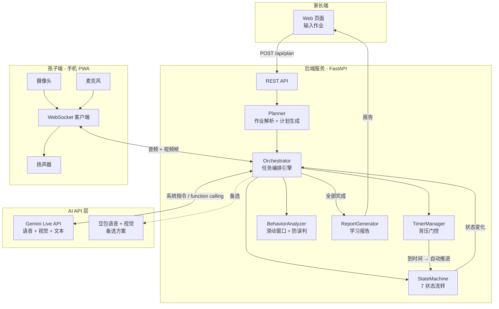
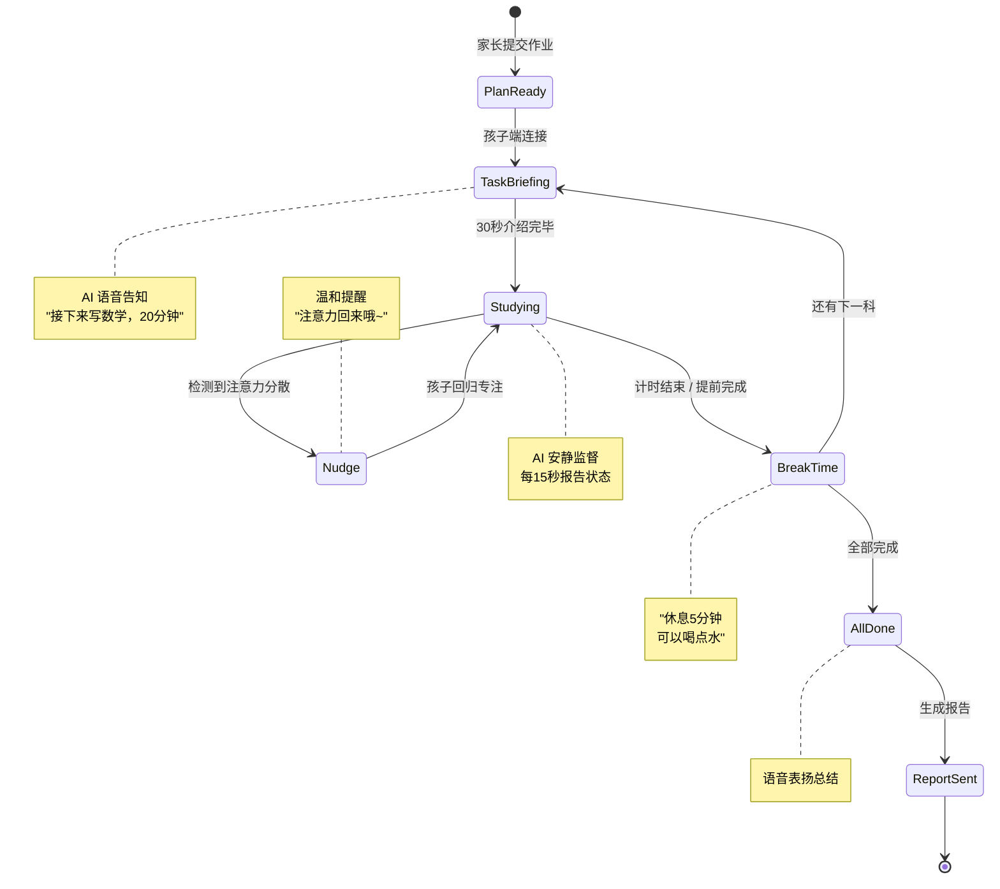
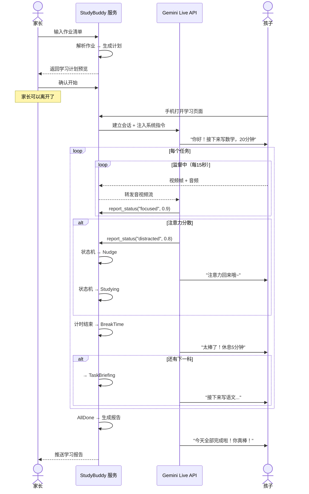
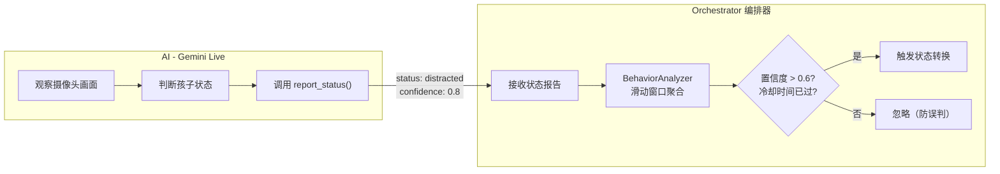
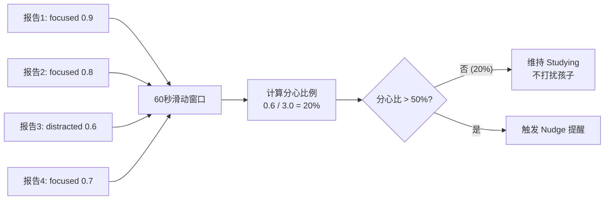
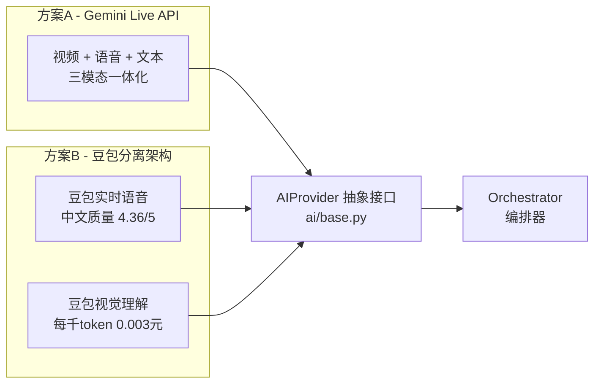
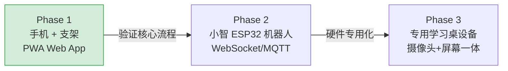
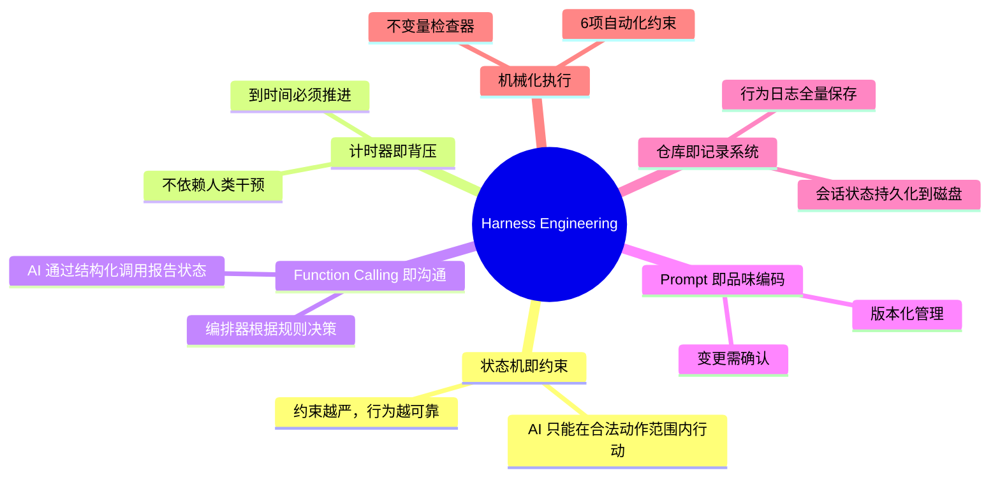

# StudyBuddyAI

> AI 作业监督系统 — 家长远程设置，AI 自主按计划陪伴孩子写作业

## 它解决什么问题

现有的 AI 对话产品（如豆包）已经具备监督孩子写作业的智能，但缺少**自主流程编排**的能力：每完成一个阶段，仍然需要家长在旁边手动切到下一步。

StudyBuddyAI 的核心就是给 AI 加上一个**驭缰系统（Harness）**：状态机 + 计时器 + 反馈回路，让 AI 能够完整地、自主地陪完一整次作业，家长只需远程设置好计划即可。

```
  裸模型（豆包C端）             StudyBuddyAI
  ┌──────────────┐          ┌──────────────────────────┐
  │   有智能      │          │  Model + Harness          │
  │   无状态      │    →     │  ├── 任务状态机（7状态）    │
  │   无编排      │          │  ├── 计时器（背压门控）     │
  │   需人工切换   │          │  ├── 反馈回路（视觉+时间）  │
  └──────────────┘          │  └── 自动推进，无需人工     │
                            └──────────────────────────┘
```

---

## 系统架构



---

## 核心状态机

这是整个系统的骨架。**状态流转由 Orchestrator 驱动，不依赖孩子操作**——孩子只需坐在那里写作业。



### 状态转换表

| 当前状态 | 事件 | 下一状态 |
|---------|------|---------|
| PlanReady | 孩子端连接 | TaskBriefing |
| TaskBriefing | 介绍完毕（30秒） | Studying |
| Studying | 计时结束 | BreakTime |
| Studying | AI 判断提前完成 | BreakTime |
| Studying | 注意力分散 | Nudge |
| Nudge | 注意力恢复 | Studying |
| BreakTime | 还有更多任务 | TaskBriefing |
| BreakTime | 全部完成 | AllDone |
| AllDone | 报告生成 | ReportSent |

---

## 使用流程



---

## AI 与编排器的沟通机制

AI 不是自由行动的——它通过 **Function Calling** 向编排器报告状态，编排器根据规则决策。



### Function Calling 定义

```
report_status(status, confidence, detail)
├── status: focused | distracted | bad_posture | playing_with_pen | looking_away | child_left_seat
├── confidence: 0~1
└── detail: 具体描述

request_phase_change(reason)
└── reason: "孩子看起来已经做完了"
```

---

## 防误判机制

不是靠单次 AI 报告就触发提醒，而是**滑动窗口聚合**后再判定。



| 分心比例 | 判定 | 动作 |
|---------|------|------|
| < 20% | 专注 | 安静陪伴 |
| 20% ~ 50% | 轻微分心 | 继续观察 |
| 50% ~ 80% | 分心 | 温和提醒 |
| > 80% | 严重走神 | 坚定提醒 |

---

## 核心特性

- **7 状态自动编排** — 状态机驱动，不依赖孩子操作，计时器到点自动推进
- **实时视觉监控** — 通过摄像头检测坐姿、注意力、是否在玩笔等，主动语音提醒
- **弹性调度** — 提前做完可以多休息或直接进入下一任务，AI 根据孩子状态动态调整
- **防误判机制** — 滑动窗口聚合行为报告，不会因为一次误判就打扰孩子
- **学习报告** — 完成后生成详细报告：各科用时、专注度、提醒次数、家长建议
- **AI Provider 可切换** — 抽象层设计，Gemini / 豆包一键切换

---

## 技术架构

```
src/studybuddy/
├── orchestrator/          # 编排引擎（大脑）
│   ├── engine.py          #   Orchestrator — 驱动状态机 + 管理 AI 会话
│   ├── state_machine.py   #   7 状态 + 10 事件 + 转换规则
│   └── timer.py           #   计时器（背压门控）
├── ai/                    # AI 抽象层
│   ├── base.py            #   AIProvider 接口
│   └── gemini_live.py     #   Gemini Live API 适配器（含 session 续期）
├── prompts/               # Prompt 模板（版本化管理）
│   ├── system_persona.md  #   全局人设：温和的学习伙伴
│   ├── studying_monitor.md#   监督阶段指令
│   └── nudge_templates.md #   提醒话术（按次数分级）
├── planner/               # 作业解析 + 计划生成
├── monitor/               # 行为分析（滑动窗口 + 防误判）
├── reporter/              # 报告生成 + 家长通知
├── client/web/            # 手机端 PWA（3个页面）
└── server.py              # FastAPI 服务（REST + WebSocket）
```

---

## 快速开始

### 1. 环境准备

```bash
python -m venv .venv
# Windows
.venv\Scripts\activate
# macOS/Linux
source .venv/bin/activate

pip install -r requirements.txt
```

### 2. 配置 API Key

```bash
cp .env.example .env
# 编辑 .env，填入你的 Gemini API Key
```

### 3. 启动服务

```bash
python -m studybuddy server
```

### 4. 使用

1. 浏览器打开 `http://localhost:8000` — 输入孩子姓名和今日作业
2. 点击"生成学习计划"预览
3. 点击"开始学习"，手机打开学习页面
4. 手机架在支架上对着书桌，AI 开始自动监督
5. 完成后查看学习报告

### CLI 工具

```bash
python -m studybuddy plan "数学:口算题卡\n语文:抄写生字" --name 小明  # 预览计划
python -m studybuddy health --json                                  # 健康检查
python scripts/lint_invariants.py                                   # 不变量检查
```

---

## AI API 选择



| 方案 | 说明 | 适用场景 |
|------|------|---------|
| **Gemini Live API**（默认） | 一个 API 搞定语音+视觉+对话 | 开箱即用，架构最简 |
| **豆包语音+视觉**（备选） | 中文语音质量业界第一 | 对中文语音有更高要求 |

通过 `AIProvider` 抽象接口隔离差异，切换只需替换适配器，核心逻辑零改动。

---

## 设备演进路径



---

## 设计理念

本项目基于 [Harness Engineering](https://openai.com/zh-Hans-CN/index/harness-engineering/) 思维设计：

> Agent = Model + Harness。裸模型不是智能体。Harness 赋予它状态、工具、反馈回路和可执行约束。



---

## 项目文档

| 文档 | 说明 |
|------|------|
| [AGENTS.md](AGENTS.md) | AI Agent 入口目录（< 100 行） |
| [docs/plan.md](docs/plan.md) | 完整设计方案 |
| [docs/PROJECT_MAP.md](docs/PROJECT_MAP.md) | 架构图 + 数据流 + 状态转换表 |
| [docs/AUTONOMY_RULES.md](docs/AUTONOMY_RULES.md) | 自主性分级规则 + 全局红线 |

## License

MIT
